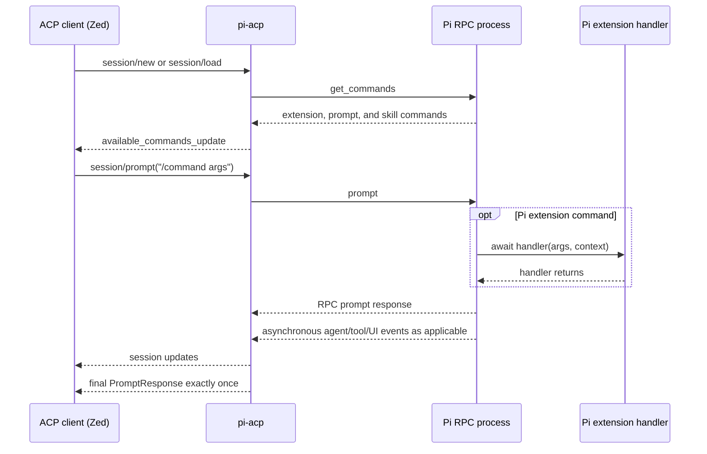

# ACP command and turn lifecycle specification

This specification covers behavior that is distributed across command discovery, ACP request handling, Pi RPC events, and queued turn state. It is the compatibility contract for this module, not an implementation walkthrough.

## External model



The Pi RPC prompt response and the ACP `PromptResponse` are different lifecycle boundaries. The former is an upstream command acceptance/handler boundary; the latter closes the client-visible turn.

## Command discovery and advertisement

Command discovery uses Pi `get_commands`; normalization is owned by `/src/acp/pi-commands.ts → toAvailableCommandsFromPiGetCommands()`.

The adapter must:

- accept both a top-level `commands` array and the legacy nested `data.commands` shape;
- discard non-object command entries at the RPC boundary instead of allowing one malformed entry to invalidate the registry;
- retain the raw `source` and `name` needed to distinguish extension commands from prompts and skills;
- tolerate additional or renamed metadata fields that are not required for dispatch;
- advertise extension commands after `session/new` and `session/load` have returned enough information for the client to recognize the session;
- attempt discovery before dispatching a slash command if the session registry has not loaded yet;
- keep command discovery best-effort so a temporary `get_commands` failure does not prevent session creation.

The current registry is a per-session snapshot. Extension installation, removal, or reload after discovery is not watched automatically; start or reload the ACP session to republish it. Any future dynamic refresh must update the internal source registry and the ACP command list as one logical operation so display and dispatch cannot disagree.

The adapter relies only on a non-empty string `name`, optional string `description`, and `source === "extension"` for extension classification. Upstream location metadata such as `location`, `path`, or `sourceInfo` is informational and must not become required accidentally.

## Command priority and dispatch

Execution ownership for a typed `/name` is:

1. a Pi extension command when the session registry identifies `name` with `source === "extension"`;
2. a pi-acp built-in when the name is built in and no extension owns it;
3. the normal session prompt path, where adapter-side file prompt expansion may apply and Pi may handle other command sources.

Consequences:

- Before intercepting a built-in in `/src/acp/agent.ts → PiAcpAgent.prompt()`, the adapter must know whether Pi registered an extension with that name.
- A recognized extension command must be forwarded to Pi unchanged, including its leading slash and arguments.
- Adapter-side file prompt expansion must never rewrite a recognized extension command.
- Unknown slash commands may still follow normal prompt/file-command behavior; Zed may reject commands that were not advertised before they reach the adapter.

Available-command merging is first-wins and currently places Pi-discovered entries before adapter built-ins. This deliberately guarantees that extension command metadata wins a collision. For a non-extension Pi prompt/skill that collides with a built-in, the displayed Pi metadata can still differ from the adapter-owned execution path. That pre-existing edge case is not part of the extension-command guarantee. If it is changed, advertisement ordering and dispatch ownership must be updated and tested together.

Do not collapse all command sources into `AvailableCommand[]` and later attempt to recover extension dispatch ownership from the displayed list. Source information is part of the routing contract.

## Turn kinds

Every queued prompt is classified once as either:

- `agent`: ordinary text, file prompt, skill, or other prompt expected to use the agent lifecycle;
- `extension`: a leading slash command whose name was discovered from Pi with `source === "extension"`.

The classification and expanded message are stored with the queued item. A command-registry refresh must not retroactively change the meaning of an already queued prompt.

## Completion contract

An ACP prompt must resolve exactly once, after all previously queued `session/update` notifications have been delivered or abandoned by the connection.

### Agent turns

An agent turn is not complete on `turn_end`; Pi may emit multiple low-level turns around tool calls.

Preferred completion:

```text
agent_start
  → zero or more turn/tool/retry/compaction events
  → agent_end
  → agent_settled
  → finish ACP turn
```

`agent_settled` is the strongest completion signal because it follows automatic retries, compaction, and continuation. For Pi versions that do not emit it, `agent_end` followed by an idle state reconciliation is the compatibility fallback. `agent_end` with `willRetry: true` must not complete the ACP turn.

### Extension turns without an agent run

A direct extension handler may finish without `agent_start` or `agent_end`. The turn may complete only when:

1. the corresponding Pi RPC `prompt` response has returned, proving the awaited handler has returned under the current Pi contract;
2. no agent loop or tool call is active locally;
3. Pi `get_state` does not report streaming, compaction, or pending messages across the configured short reconciliation window.

The reconciliation window is a race guard, not proof that arbitrary future work will never start. A failed `get_state` request does not prove that Pi is idle. The adapter may retry transient failures, but it must observe at least one successful idle state before returning `end_turn`; if every bounded query fails, the turn fails rather than being reported as successful.

A command-scoped Pi `extension_error` must be surfaced to the ACP client. Once the corresponding direct handler response returns, the internal turn result is `error`; unrelated extension lifecycle errors may be displayed without changing the active turn's result. ACP clients without an `error` stop reason still receive the visible error message.

### Extension turns that start an agent run

If an extension starts an agent run before its handler returns, completion requires both boundaries:

- the agent lifecycle has settled; and
- the extension's own RPC `prompt` response has returned.

This prevents an agent event from closing the ACP turn while the extension handler or external TUI is still active.

### Unsupported delayed-work pattern

The adapter cannot reliably associate work started after an extension handler has returned, for example:

```ts
setTimeout(() => pi.sendUserMessage('later'), 2_000)
```

At the time the handler returns, Pi can truthfully report idle and the ACP prompt may close. Extension code that requires the work to belong to the current turn must await it or use an upstream lifecycle primitive that makes the pending work observable. Increasing a fixed delay is not a protocol-level solution.

## Queue and stale-work safety

- At most one ACP prompt is active per `PiAcpSession`; later prompts are queued in arrival order.
- Every active turn has a monotonically increasing ID.
- Timers, RPC continuations, state checks, and event-driven completion must verify that ID before mutating or finishing the active turn.
- Finishing is idempotent. Duplicate `agent_end`, `agent_settled`, RPC responses, or delayed checks must not resolve twice.
- The active turn is cleared before the next queued turn starts.
- On prompt failure, queued prompts are not started automatically because the Pi subprocess may be unhealthy.
- Cancellation clears queued prompts and sends Pi `abort` for the active turn. The final stop reason is `cancelled` when cancellation was requested.
- A prompt waiting for command discovery is also cancellable. Cancellation must invalidate the request before any adapter built-in or Pi prompt is executed, even though it has not entered the active-turn queue yet.

## Extension UI protocol

Pi extension UI methods have two different response contracts.

| Class           | Methods                                                           | Adapter response rule                                                  |
| --------------- | ----------------------------------------------------------------- | ---------------------------------------------------------------------- |
| Dialog          | `select`, `confirm`, `input`, `editor`                            | Exactly one `extension_ui_response` when handled, cancelled, or failed |
| Fire-and-forget | `notify`, `setStatus`, `setWidget`, `setTitle`, `set_editor_text` | Never send `extension_ui_response`                                     |

Current ACP mapping:

- `select` and `confirm` use ACP permission requests.
- `notify` becomes an ACP agent message.
- `input` and `editor` are visibly cancelled because the current ACP permission surface cannot return arbitrary text.
- Other fire-and-forget methods are accepted as no-ops unless a future ACP mapping is added.

An exception handler must not send a cancellation response for a fire-and-forget event. Doing so violates Pi's protocol and may create an unmatched response.

External terminal/custom UI rendering is outside this module. An extension-side adapter may keep `ctx.ui.custom()` component logic in the Pi process and use a separate terminal as its renderer. From this module's perspective, it is an awaited extension handler and must obey the extension completion contract above.

## Change rules

When modifying this module:

- A Pi update that changes `get_commands`, direct extension execution, RPC prompt response timing, `agent_end`/`agent_settled`, `get_state`, or extension UI response rules requires a compatibility review using [`../../docs/upstream-compatibility.md`](../../docs/upstream-compatibility.md).
- New busy-state fields may be added to idle reconciliation, but removing an existing signal requires evidence that current supported Pi versions no longer need it.
- A new command source must define advertisement, collision priority, expansion ownership, and turn kind explicitly.
- A new UI method must first be classified as dialog or fire-and-forget from upstream types/runtime before a mapping is implemented.
- Do not make completion depend on presentation-only ACP updates, client rendering, or Zed-specific UI visibility.

## Required regression coverage

The focused tests must continue to prove:

- extension commands are advertised for new and loaded sessions;
- malformed `get_commands` entries are ignored without losing valid extension ownership metadata;
- extension commands win collisions with adapter built-ins and file prompts;
- recognized extension text is forwarded unchanged;
- pure extension commands complete without `agent_end`;
- extension-started agent runs do not complete early;
- retry/compaction settlement is respected;
- handler completion and agent settlement can arrive in either order;
- stale reconciliation cannot finish the next queued turn;
- cancellation during command discovery prevents both adapter built-ins and Pi prompts from starting;
- command-scoped `extension_error` is visible and does not become a silent successful turn;
- state reconciliation retries transient failures and cannot succeed when every state query fails;
- fire-and-forget UI receives no response;
- dialog UI receives at most one response.

See [`../../docs/validation.md`](../../docs/validation.md) for the test-to-risk map and real-client acceptance scenarios.
